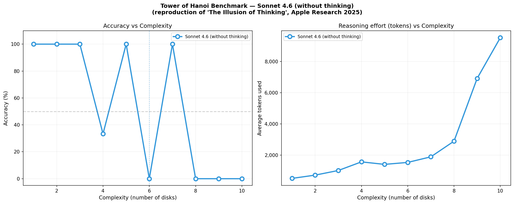
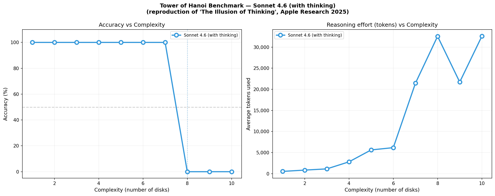

# Tower of Hanoi Benchmark — Claude Sonnet 4.6: Thinking vs No Thinking
### A partial reproduction of *"The Illusion of Thinking"* (Apple Research, 2025)

---

*Experiment run: February 2026*
*No thinking: 3 samples per N, max_tokens=8,000, model: claude-sonnet-4-6*
*With thinking: 3 samples per N, max_tokens=32,000, adaptive thinking, model: claude-sonnet-4-6*
*Original paper: Shojaee et al., "The Illusion of Thinking", Apple Research, 2025*

---


## Context

This experiment reproduces part of the methodology from the paper **"The Illusion of Thinking: Understanding the Strengths and Limitations of Reasoning Models via the Lens of Problem Complexity"** published by Apple Research (Shojaee et al., 2025).

> Shojaee et al. (2025). *The Illusion of Thinking: Understanding the Strengths and Limitations of Reasoning Models via the Lens of Problem Complexity.* Apple Research. [arxiv.org/abs/2506.06941](https://arxiv.org/abs/2506.06941)

The original paper tested frontier Large Reasoning Models (LRMs) — including Claude 3.7 Sonnet, DeepSeek-R1, and o3-mini — on controllable puzzle environments to study how reasoning quality scales with problem complexity. Their central finding: all models exhibit a **complete accuracy collapse** beyond a model-specific complexity threshold, even with ample token budget.

This reproduction runs the Tower of Hanoi puzzle on **Claude Sonnet 4.6** in two configurations: without thinking (8k token budget) and with adaptive thinking (32k token budget). 3 samples per complexity level, N=1 to N=10.

> **Differences from the original paper:** The original used 25 samples per N, up to N=20, with a 64k token budget. This is a lightweight reproduction designed to validate the core phenomenon at lower cost.

---

## Results

### Without thinking (max_tokens=8,000)


### With adaptive thinking (max_tokens=32,000)



## Results Summary

| N | Min moves | No thinking (accuracy) | No thinking tokens avg | With thinking (accuracy) | Thinking tokens avg |
|---|-----------|------------------------|------------------------|-------------------------|---------------------|
| 1 | 1 | **100%** | 559 | **100%** | 533 |
| 2 | 3 | **100%** | 789 | **100%** | 843 |
| 3 | 7 | **100%** | 1,054 | **100%** | 1,131 |
| 4 | 15 | **67%** | 1,473 | **100%** | 2,803 |
| 5 | 31 | **100%** | 1,525 | **100%** | 5,623 |
| 6 | 63 | **0%** | 2,338 | **100%** | 6,166 |
| 7 | 127 | **100%** | 1,941 | **100%** | 21,435 |
| 8 | 255 | **0%** | 3,106 | **0%** ← COLLAPSE | 32,561 |
| 9 | 511 | **0%** | 5,361 | **0%** ← COLLAPSE | ~32,567 |
| 10 | 1023 | **0%** | 8,599 | **0%** ← COLLAPSE | 32,573 |

---

## Key Observations

### 1. Thinking dramatically extends the solving range

The most striking result: with adaptive thinking, Sonnet 4.6 solves **N=6 perfectly** (100%) — a level where the no-thinking version collapses to 0% on all 3 samples with the same systematic error. This is a direct validation of the paper's claim that thinking modes delay the collapse threshold.

Collapse point comparison:
- **Without thinking**: collapses at N=6 (with anomalous recovery at N=7)
- **With thinking**: collapses at N=8, solving cleanly up to N=7

That's a **+2 disk improvement** in the effective solving range, which corresponds to solving puzzles requiring up to 4× more moves (127 vs 31 minimum moves before collapse).

### 2. The collapse at N=8 is hard and immediate

With thinking, the drop from N=7 (100%) to N=8 (0%) is a cliff — no partial failures, no recovery. All 3 samples at N=8 fail with the same error: "No moves extracted." The model burns through ~32k tokens but produces no valid move list, suggesting it ran out of token budget mid-generation rather than producing wrong moves.

This is different from the no-thinking collapse, where the model *does* produce moves but makes an illegal move at a specific position. The thinking model appears to attempt a more elaborate generation that simply doesn't fit in the budget.

### 3. The token behavior confirms the paper's central finding

The token usage curve for the thinking run is highly revealing:

- N=1 to N=6: tokens grow steadily with complexity (533 → 6,166)
- N=7: massive jump to ~21,435 tokens — the model throws significant effort at this
- N=8 to N=10: tokens plateau at ~32,561 — the hard limit

This is the **"capitulation" pattern** described in the original paper: beyond a threshold, models don't gracefully reduce effort — they hit the wall. The slight token increase from N=8 to N=10 (32,561 → 32,573) suggests the model is consistently maxing out the budget without producing valid output.

### 4. The no-thinking odd/even anomaly disappears with thinking

Without thinking, there's a striking non-monotonic pattern — the model fails at N=6, then inexplicably succeeds at N=7 (100%, perfect 127-move solutions), then fails again at N=8. This suggests N=7 solutions are memorized rather than reasoned.

With thinking, the accuracy curve is perfectly monotonic: 100% from N=1 to N=7, then 0% from N=8 onward. This is the clean sigmoid collapse the paper predicted. The thinking mode appears to eliminate the memorization artifact and replace it with genuine (but still limited) reasoning.

### 5. The specific failure mode shifts completely

| N | No thinking failure | With thinking failure |
|---|--------------------|-----------------------|
| 6 | Move #31: illegal disk placement (100% of samples) | None — solved perfectly |
| 8 | Move #127: illegal disk placement (100% of samples) | No moves extracted — token budget exhausted |

Without thinking, the model produces wrong moves at a precise position (the midpoint where the largest disk must be placed). With thinking, it never even produces moves for N=8+ — it runs out of space before outputting the solution. These are fundamentally different failure modes: one is a reasoning error, the other is a generation capacity limit.

---

## Comparison with the Original Paper

| Observation | Apple Paper (Claude 3.7 Thinking) | This run (Sonnet 4.6 + adaptive thinking) |
|---|---|---|
| Collapse threshold | ~N=8–10 | N=8 |
| Accuracy below threshold | 100% | 100% (N=1–7) |
| Accuracy above threshold | 0% | 0% (N=8–10) |
| Token growth then plateau | Yes — decreases counterintuitively | Yes — hits hard limit |
| Failure mode above threshold | Various | Token budget exhausted |
| Non-monotonic accuracy | Observed | Not observed — clean collapse |

The results are remarkably consistent with the paper's findings on Claude 3.7 Thinking, despite Sonnet 4.6 being a newer and more capable model. The collapse threshold is similar, and the fundamental limitation — inability to execute long sequential reasoning chains reliably — appears unchanged across model generations.

---

## What this suggests about thinking modes

The comparison between the two runs reveals something important: **adaptive thinking doesn't fix the fundamental limitation, it shifts it.** The model gains 2 extra complexity levels, but the cliff is just as abrupt. More compute buys more capability up to a point, then collapses entirely.

This supports the paper's architectural argument: the failure is not about reasoning quality per se, but about the **inability of autoregressive models to track and maintain state across hundreds of sequential, interdependent steps**. Extended thinking gives more scratch space, but doesn't change the underlying mechanism.

The N=8 token exhaustion pattern also raises a methodological point: with a larger token budget (64k as in the original paper), the thinking model might produce wrong moves at N=8 rather than no moves at all — potentially revealing deeper failure modes. Increasing the budget further is a natural next step.

---

## Usage

```bash
pip install anthropic matplotlib numpy
```

```bash
# Set your API key
$env:ANTHROPIC_API_KEY="sk-ant-..."   # PowerShell
export ANTHROPIC_API_KEY="sk-ant-..."  # bash/zsh
```

```bash
# Run without thinking (~$1-2)
python hanoi_benchmark.py

# Run with adaptive thinking (~$5-8)
python hanoi_benchmark.py --thinking --max-tokens 32000

# Compare both on same chart (~$8-12)
python hanoi_benchmark.py --compare --max-tokens 32000

# Full options
python hanoi_benchmark.py --model [sonnet|opus] --thinking --n-max 12 --samples 5 --max-tokens 32000
```

---

## Pricing estimate

| Run | Config | Estimated cost |
|-----|--------|---------------|
| No thinking | N=1–10, 3 samples, 8k tokens | ~$1–2 |
| With thinking | N=1–10, 3 samples, 32k tokens | ~$5–8 |
| Compare mode | Both runs combined | ~$8–12 |

---

## Next steps

- **Increase token budget to 64k** for the thinking run to observe the actual reasoning failure at N=8 (vs. budget exhaustion)
- **Run with `--compare` mode** to generate a side-by-side visualization of both curves on the same chart
- **Increase samples to 5–10** for more statistical reliability, especially around the collapse boundary (N=6–8)
- **Test Opus 4.6** to see if the larger model pushes the threshold to N=9 or N=10

